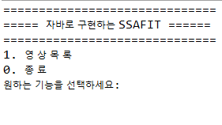
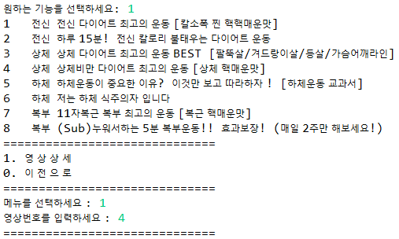
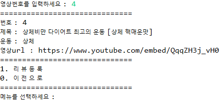
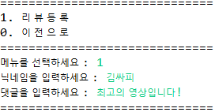
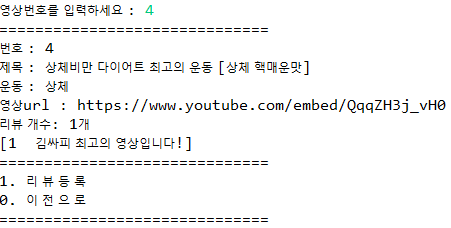

# 관통프로젝트

# 

## [ 작업 내용 ]

      저희 팀은 주어진 과제에서 기초 기능을 구현했습니다.

- 제공되는 영상정보 데이터 파일을 기반으로 필요한 정보를 파싱 처리한 후 영상정보를
  제공하는 목록 화면과 영상에 대한 리뷰를 관리하는 프로그램을 구현했습니다.
  
  
- 데이터 파일은 JSON 형태로 제공된다. 데이터 처리는 라이브러리를 사용했습니다.
  
  
- 콘솔 UI화면에서 영상을 선택한 후 선택한 영상과 관련된 리뷰 목록, 등록 기능을 제공합니다.

## [ 작업 사진 ]

##### [ 시작화면 ]

##### [ 기능 선택 ]

##### [ 상세정보 ]

##### [ 리뷰 ]

##### [ 리뷰 추가 ]

#### 

## [ 소감 ]

{ 김평섭 } 

    => 지난주까지 배웠던 자바를 복습할 수 있어서 좋았고, gson을 활용해 외부파일을 활용했다는 점에서 앞으로 할 수 있게 된 프로젝트의 범위가 넓어진 느낌을 받았습니다.
 또 원래는 switch를 중복으로 사용해서 코드를 짜왔었는데 이번 프로젝트에서는 상속을 통한 함수형 방식으로 코드를 짜게 된 점과, 혼자서만 문제를 풀어왔었는데 관통 프로젝트를 통해서 처음으로 같이 프로젝트를 하게 된 점등이 새로워서 좋았습니다.

{ 이건희 }

    => 10일간의 자바 교육 내용을 총 복습 해 볼 수 있어 좋았습니다. 전체적으로 복습을 하게 되니 어떤 부분을 몰랐는지 알 수 있었고, 해당 부분을 잘 보완 할 수 있었습니다. 페어 평섭님과의 페어 코딩 과정을 통해 서로 설명하고 복습하며, 자바 개발 역량을 더 끌어올렸다고 확신합니다. 정말 좋은 경험이었습니다.

#### 
