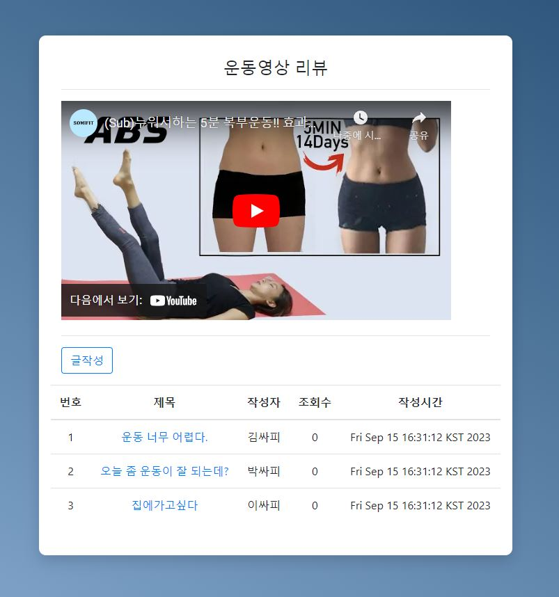
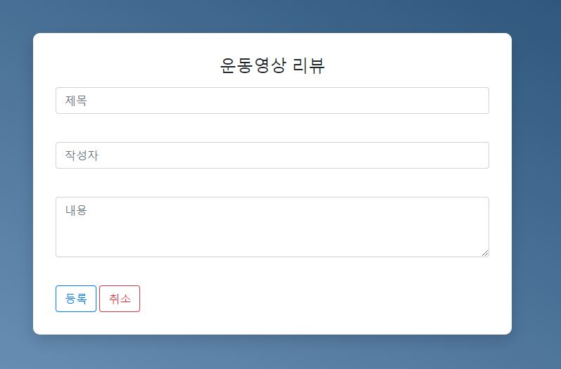
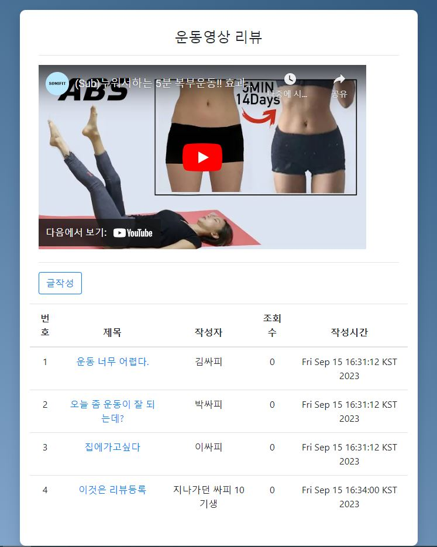
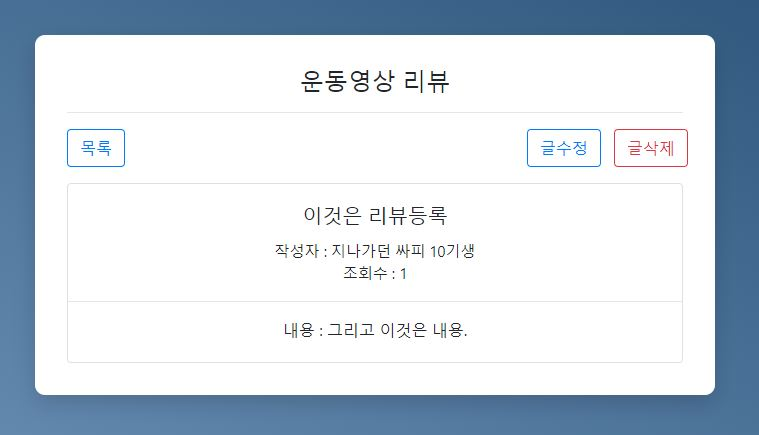
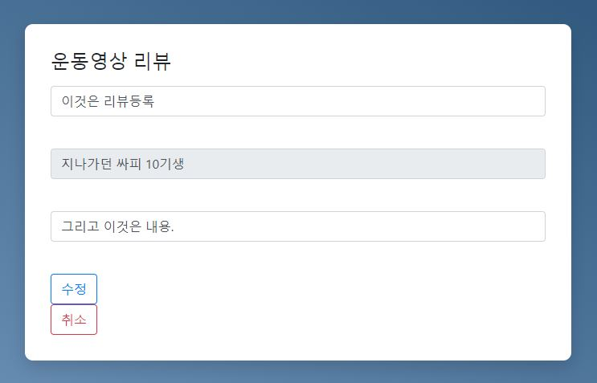
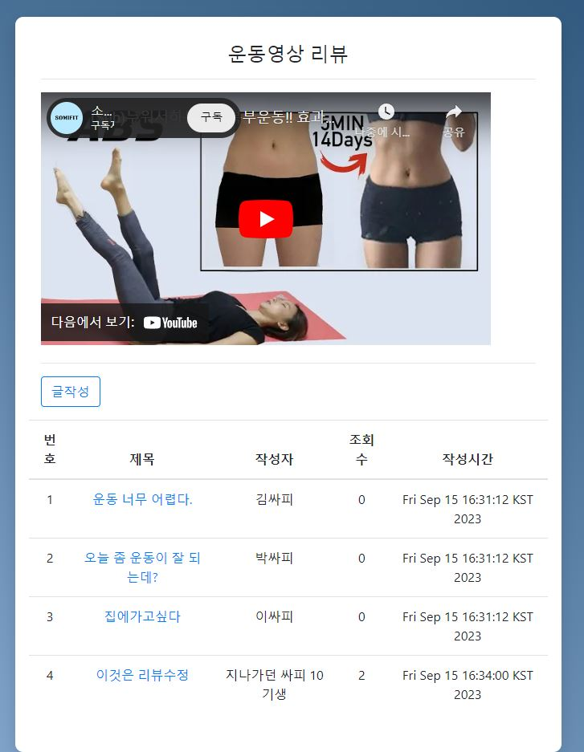
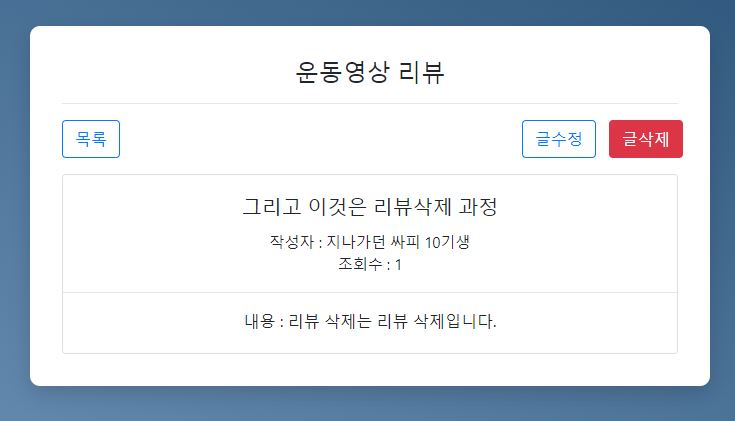
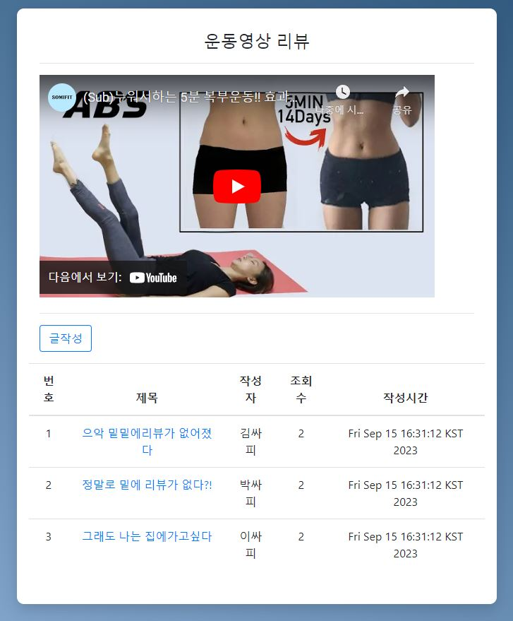

# Back 관통 프로젝트(SSAFIT)

## 소감

김평섭 : 처음으로 백엔드를 배운지 2주만에 게시판을 만들게 되었습니다. 프론트 관통은 처음은 어려웠지만 후반으로 갈수록 자신감이 생겼었는데, 백엔드는 아직도 잘 모르겠습니다. 리뷰목록과 메인화면 2가지를 구현했었어야 했는데, 리뷰목록 하나만 구현하는 것만으로도 벅찼습니다. 그래도 하나라도 잘 돌아가서 다행입니다.

반주현 : 아쉽게도 주어진 모든 요구사항을 충족할 수 없었습니다. 심지어 가장 메인 화면이라고 할 수 있는 index.html조차 이전 프론트엔드 관통프로젝트할때와는 다르게 정상적으로 출력되지 않아서 강의시간과 같이 바로 리뷰 목록으로 넘어가게끔 만들었다는 점이 아쉬웠습니다. 그나마 이전 프론트엔드를 할 때에는 한 걸음조차 건너기 버거웠다면, 이번 백엔드 관통프로젝트에는 부족하지만 한 걸음 정도는 뗀 것 같다는 생각이 듭니다. 언젠가는 능숙하게 만들 수 있게 되면 좋겠습니다.

## 구현 프로그램 소개

### -  리뷰목록 화면

### - 리뷰등록(글작성) 화면

### - 등록 후 리뷰목록 화면

### - 리뷰상세 화면

### - 리뷰수정 화면

### - 수정 후 리뷰목록 화면

### - 리뷰삭제 화면

### - 삭제 후 리뷰목록 화면

